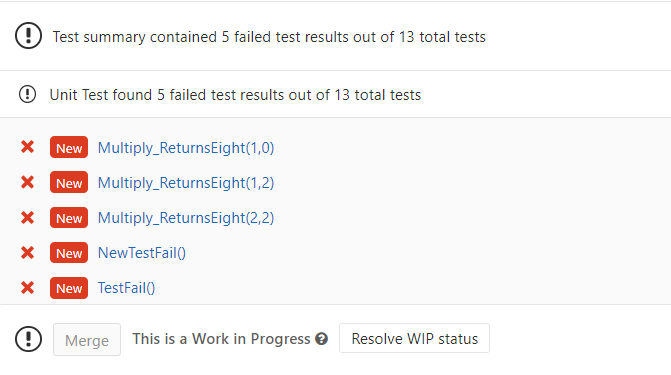
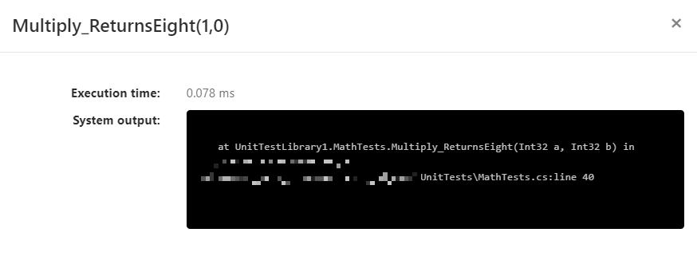
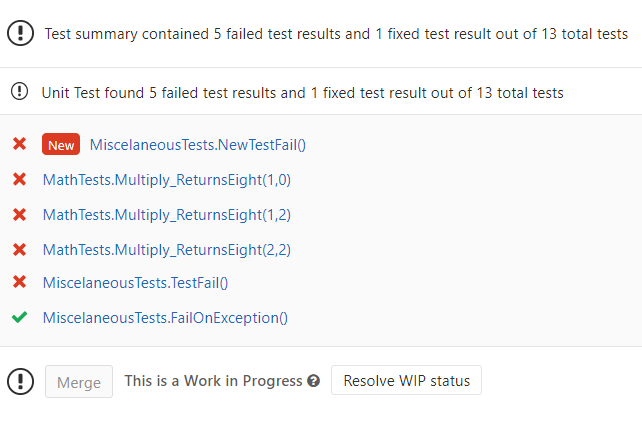
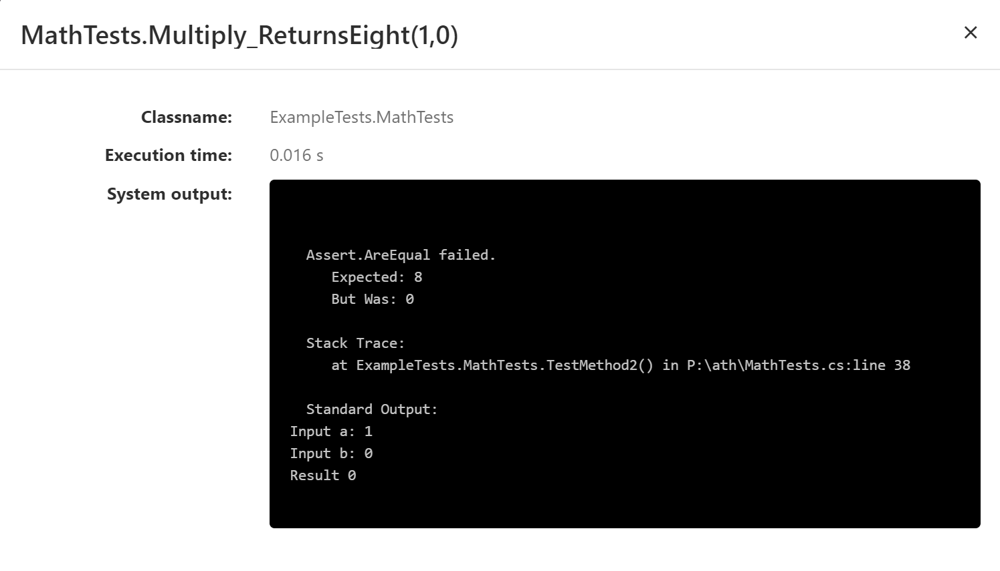

# GitLab CI/CD Recommendation

GitLab uses just a few pieces of the XML report to generate the displayed user interface. The formatting options available in this project can improve the usefulness of this UI. 

## Default Display

The summary view shows passing and failing tests by method name (including any parameters). GitLab generates its summary of New failing tests, existing failing tests, and newly passing tests based on this string. 



The popup displayed when clicking on a test, shows only the body of the failure. 



## Improved Output With Formatting Options

The test summary can be modified by setting the method format. The option below used 'MethodFormat=Class'. This is purely a matter of preference, but including the class name, or even the assembly and namespace, may make it easier to track test failures in the UI back to code. 



The popup is much more useful with the inclusion of the 'Expected X, Actual Y' data. This is added to the failure body using 'FailureBodyFormat=Verbose'



## Example .gitlab-ci.yml

Below is example .yml which implements the options shown above. Additionally, this example collects the output from all test projects into a single folder, and uploads their reports to gitlab.

``` yml
Test:
  stage: Test
  script: 
    - 'dotnet test --test-adapter-path:. --logger:"junit;LogFilePath=..\artifacts\{assembly}-test-result.xml;MethodFormat=Class;FailureBodyFormat=Verbose"'
  artifacts:
    when: always
    paths: 
     - .\artifacts\*test-result.xml
    reports:
      junit: 
       - .\artifacts\*test-result.xml
```       

## Notes

Screen shots and behavior are current as of GitLab Community Edition 11.11.8. 
